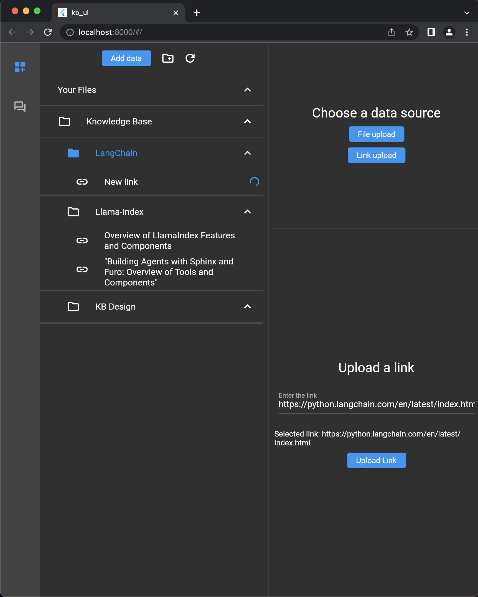
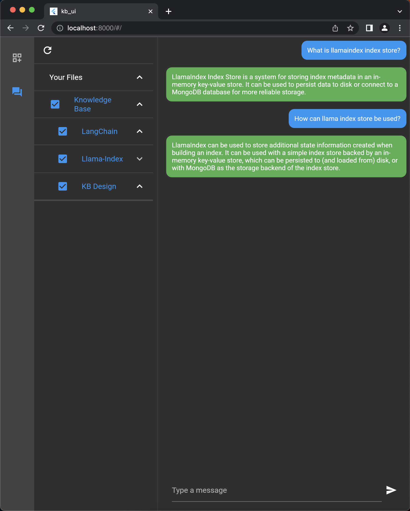
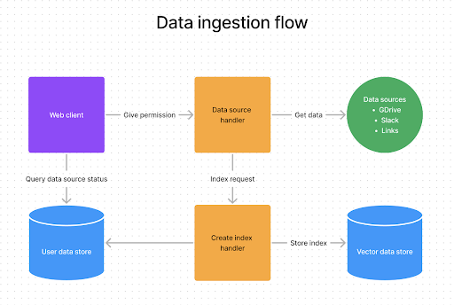
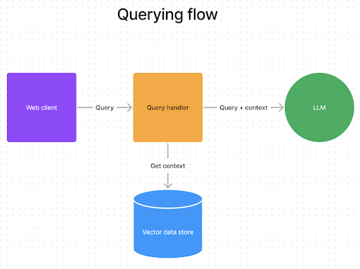

# LLM Knowledge Base
A self-hosted solution to internal search. It provides an interface to index your data and ask question about them using natural language.

This project orchestrates a full stack application with a client, server and databases on your local machine (LLM not included).

# Project Setup

## Prerequisites
Ensure the following tools are installed on your machine:

- OpenAI API key: The current LLM used is OpenAI GPT-3.5 so you need an API key to use it. You can get one [here](https://platform.openai.com/).
- Docker: Install from [Docker official page](https://docs.docker.com/get-docker/)
- Docker Compose: Install from [Docker official page](https://docs.docker.com/compose/install/)

## Run setup script

The setup script ensures docker compose is set up, create the `.env` file and creates `mongo-keyfile` for MongoDB.

Here are the steps to run this script:

1. Open a terminal.
2. Navigate to the root directory of the project.
3. Run the following command to ensure setup.sh has execute permissions:
```
chmod +x setup.sh
```
4. Now run the setup script:

```
./setup.sh
```

Note: For MacOS, the script will need to be modified. See comment in `setup.sh` for more details.

# Run the app

Make sure you have `docker compose` installed. In root folder:
```
docker compose up
```

The first run may take a few minutes. This will start the following services on ports: 
- 8000: flutter client
- 8001: flask server
- 8002: weaviate database (Not used atm)
- 8003: mongodb database

Go to `localhost:8000` to start using the app.


# Usage

1. Data ingestion:

To add your own data, select or create a target folder and click add data. Then paste a link or upload a file to the app. The ingestion engine will index your data and generate a title and summary for it.



2. Querying 

To ask questions, select what data source you want to limit your query to, then ask your question. You can query your entire knowledge base (though it may take longer to answer). 




# Design 

The project is a full stack application using docker compose to orchestrate containers for: 
1. Flutter client to manage your data and chat with them
2. Flask server to ingest and index your data
3. MongoDB database to store your metadata
4. Weaviate vector store to store your indices

There are 2 main flows to use:
1. Data ingestion



2. Querying 




# Components
- Client: [Flutter](https://flutter.dev/)
- Server: [Flask](https://flask.palletsprojects.com)
- Key-value database: [MongoDB](https://www.mongodb.com/)
- Vector database: [Weaviate](https://weaviate.io/) (Not used atm)

# Resources
- [LLM Knowledge retrieval](https://mattboegner.com/knowledge-retrieval-architecture-for-llms/)
- [LlamaIndex with MongoDB](https://medium.com/llamaindex-blog/build-a-chatgpt-with-your-private-data-using-llamaindex-and-mongodb-b09850eb154c)
- [Graph with Weaviate](https://gpt-index.readthedocs.io/en/latest/examples/composable_indices/ComposableIndices-Weaviate.html)

# Next steps
- Implement memory for chat
- Add other data source types
- Explore local LLM for full privacy
- Add agents for better data retrieval

# License
This project is licensed under the [Apache License 2.0](https://opensource.org/licenses/Apache-2.0). See the [LICENSE](LICENSE) file for more details.